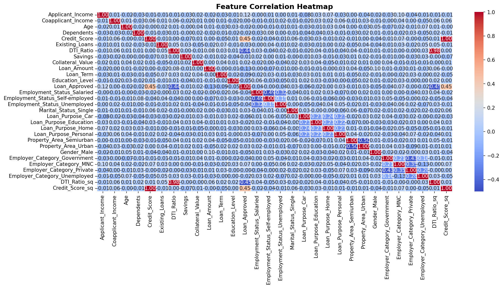
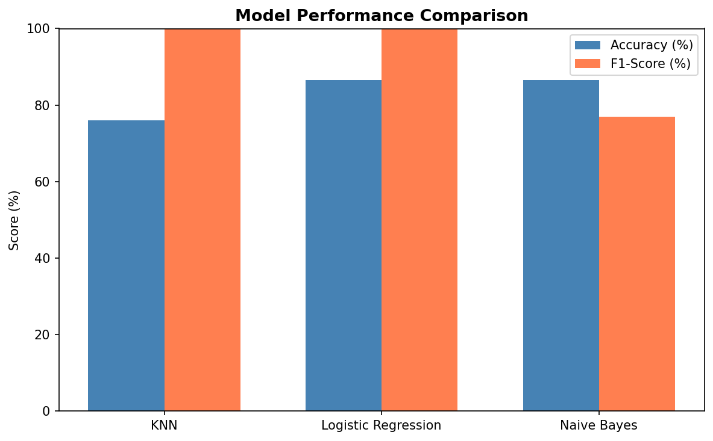
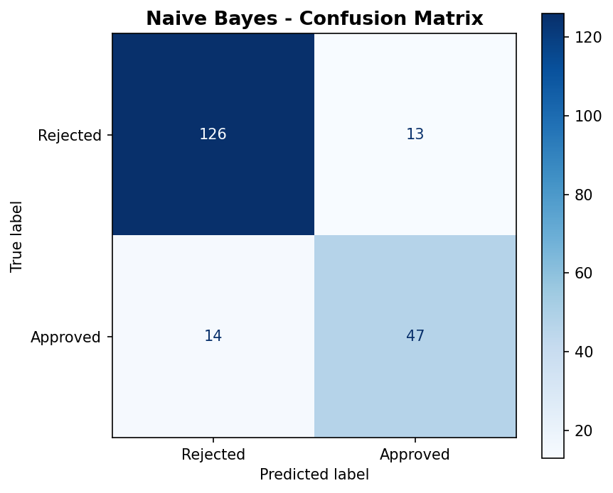

# CreditWise Loan Approval System

> End-to-end supervised machine learning pipeline predicting loan approval decisions.


---

## Overview
Binary classification system analyzing **1,000 loan records across 20 features**  
to automate loan approval predictions. Three ML algorithms compared; key financial 
drivers identified through EDA and correlation analysis.

---

## Results

| Model | Accuracy | Precision | Recall | F1-Score |
|-------|----------|-----------|--------|----------|
| **Naive Bayes** | **86.5%** | **80.35%** | **73.77%** | **76.92%** |
| Logistic Regression | 86.50% | 78.33% | 77.04% | 77.68% |
| KNN | 76% | 62.74% | 52.45% | 57.14% |

---

## Visualizations

### Correlation Heatmap


### Model Performance Comparison


### Confusion Matrix (Best Model — Naive Bayes)


---

## Business Impact & Insights

This model is designed to support bank loan officers in making faster, 
data-driven approval decisions.

- **Precision (80.35%)** — When the model predicts "Approve," it is correct 80% 
  of the time. This directly reduces the number of defaulted loans reaching the bank's books.

- **Recall (73.77%)** — The model misses ~26% of genuinely eligible applicants. 
  This represents a trade-off: the bank gains protection from bad loans but 
  may turn away some creditworthy customers.

- **Business recommendation:** The classification threshold can be adjusted based 
  on the bank's risk appetite — tighten it to minimize defaults, or loosen it 
  to capture more eligible customers. This is a business decision, not a 
  technical one.

**Key drivers identified through EDA:**
- Credit Score — strongest positive predictor of approval
- DTI (Debt-to-Income) Ratio — strongest negative predictor of approval

---

## Tech Stack
`Python` `Pandas` `NumPy` `Scikit-learn` `Matplotlib` `Seaborn` `Jupyter Notebook`

---

## ML Pipeline
1. Exploratory Data Analysis + correlation heatmap
2. Data preprocessing — imputation, encoding, feature scaling
3. Model training — KNN, Logistic Regression, Naive Bayes
4. Evaluation — Accuracy, Precision, Recall, F1-Score, Confusion Matrix

---

## How to Run
```bash
pip install -r requirements.txt
jupyter notebook credit_wise.ipynb
```

---

## Dataset
1,000 loan applications | 20 features | Binary target: Approved / Rejected
